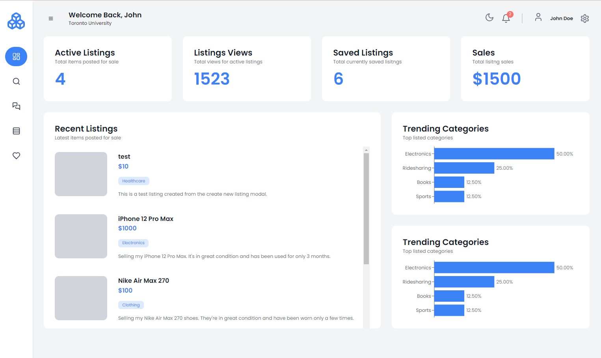
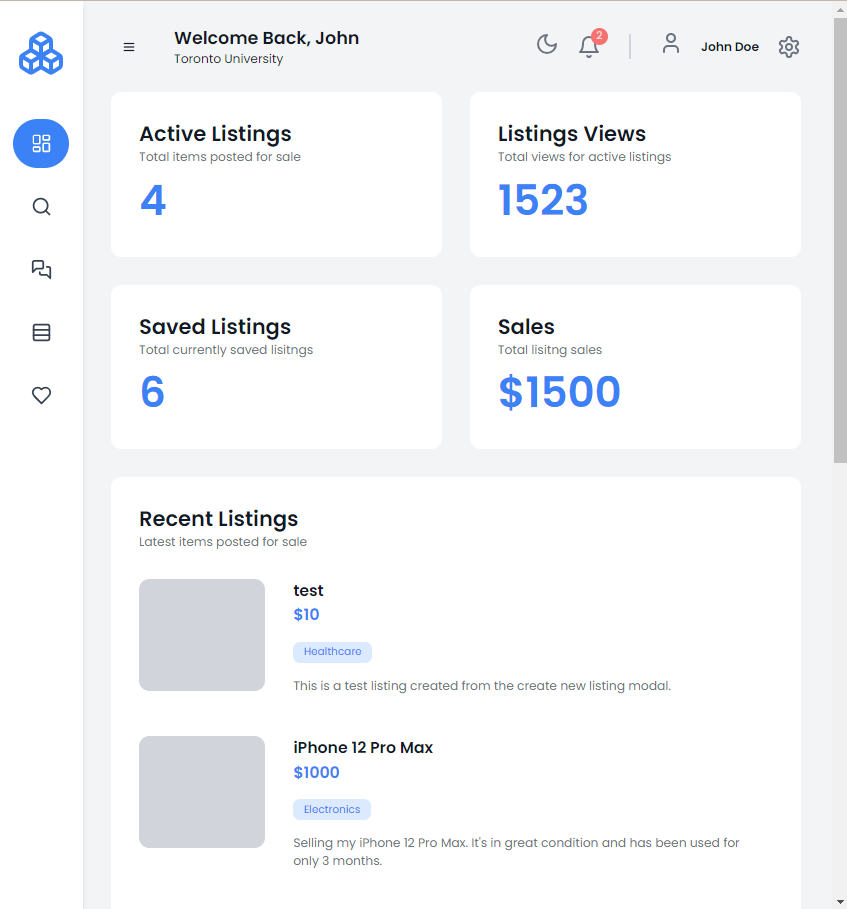
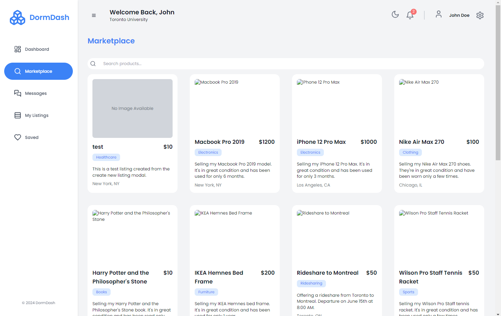
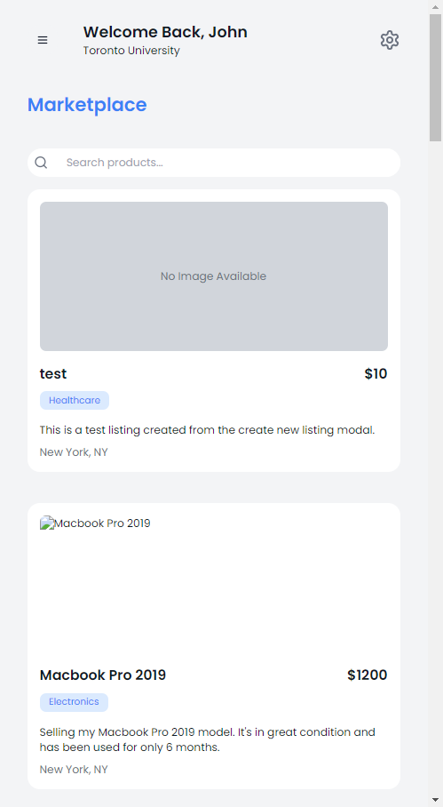
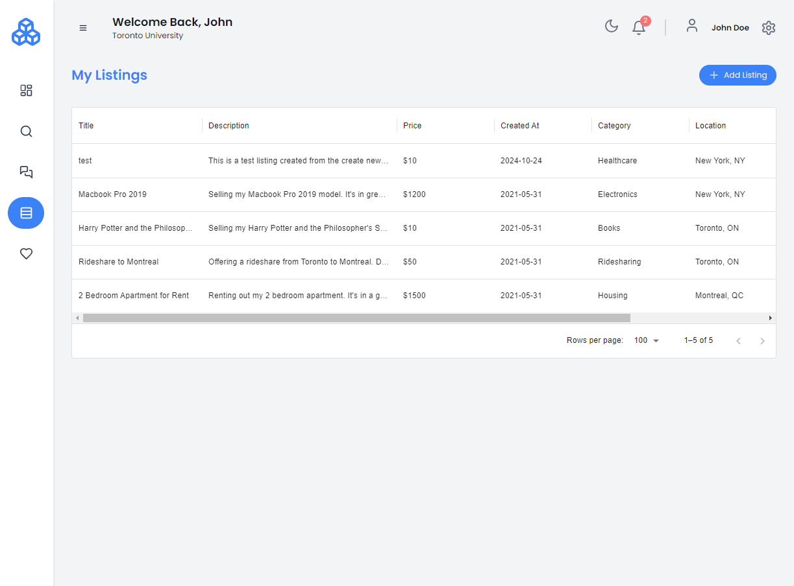

# 🎓 Student Marketplace | Full-Stack Next.js Application

[](https://www.typescriptlang.org/)
[](https://nextjs.org/)
[](https://reactjs.org/)
[](https://www.postgresql.org/)

A modern, full-stack marketplace platform designed specifically for students to buy and sell items. Built with Next.js and TypeScript, featuring a responsive dashboard, real-time listings, and seamless user experience.



## ✨ Key Features

- **Interactive Dashboard** - Quick access to marketplace statistics and recent listings
- **Dynamic Marketplace** - Browse all available listings with powerful search functionality
- **Personal Listings Management** - Create, view, and manage your own listings
- **Modern UI/UX** - Sleek interface with dark/light theme support
- **Responsive Design** - Seamless experience across all devices
- **Real-time Database** - Instant updates using PostgreSQL and Prisma
- **Type-Safe Development** - End-to-end TypeScript implementation

## 🛠️ Technology Stack

### Frontend
- **Next.js** - React framework for production-grade applications
- **TypeScript** - Static typing for enhanced development experience
- **React** - UI component library
- **TailwindCSS** - Utility-first CSS framework
- **Material-UI (MUI)** - React UI component library
- **Redux Toolkit** - State management solution

### Backend
- **Node.js** - JavaScript runtime
- **Express** - Web application framework
- **Prisma** - Next-generation ORM
- **PostgreSQL** - Open-source relational database

### Development Tools
- **ESLint** - Code quality tool
- **Nodemon** - Development server auto-reload
- **Rimraf** - Cross-platform file removal
- **Concurrently** - Run multiple commands concurrently

## 🚀 Getting Started

### Prerequisites
Ensure you have the following installed:
- Node.js (v14 or higher)
- npm or yarn
- PostgreSQL

### Installation

1. Clone the repository
```bash
git clone https://github.com/kgriffiths10/fullstack-nextjs-marketplace.git
cd fullstack-nextjs-marketplace
```

2. Install dependencies
```bash
# Install client dependencies
cd client
npm install

# Install server dependencies
cd ../server
npm install
```

### Running the Application

1. Start the backend server
```bash
npm run dev
```

2. Start the frontend development server
```bash
cd client
npm run dev
```

Navigate to `http://localhost:3000` to see the application in action!

## 📱 Application Screenshots

### Dashboard View

*Quick access to marketplace statistics and recent listings*

### Marketplace

*Browse and search through available listings*


*Even on small screens, browse and search through available listings*

### Personal Listings

*Manage your personal marketplace listings*

## 🎯 Future Enhancements

- Real-time chat between buyers and sellers
- Advanced filtering and sorting options
- User ratings and reviews system
- Mobile application development

## 🤝 Contributing

Contributions, issues, and feature requests are welcome! Feel free to check the [issues page](https://github.com/kgriffiths10/fullstack-nextjs-marketplace/issues).

## 📝 License

This project is [MIT](LICENSE) licensed.

---

*Built with ❤️ by kgriffiths10*